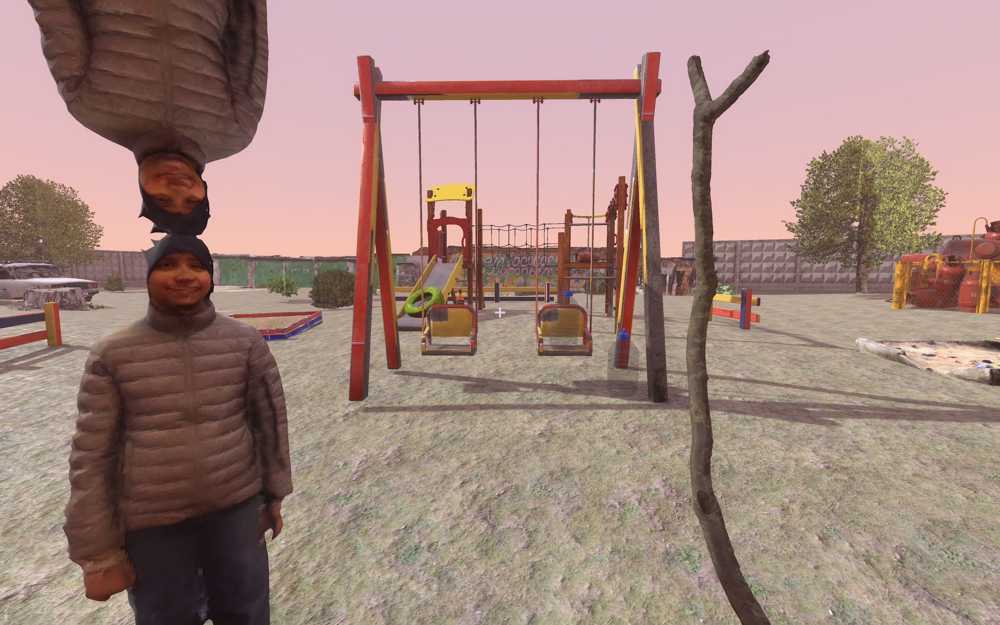
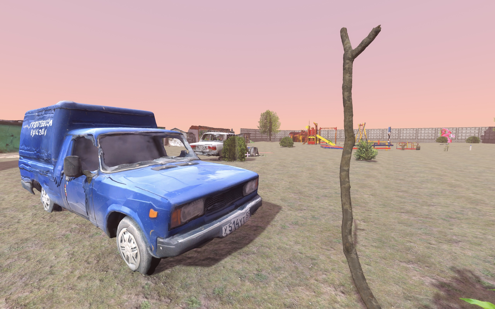
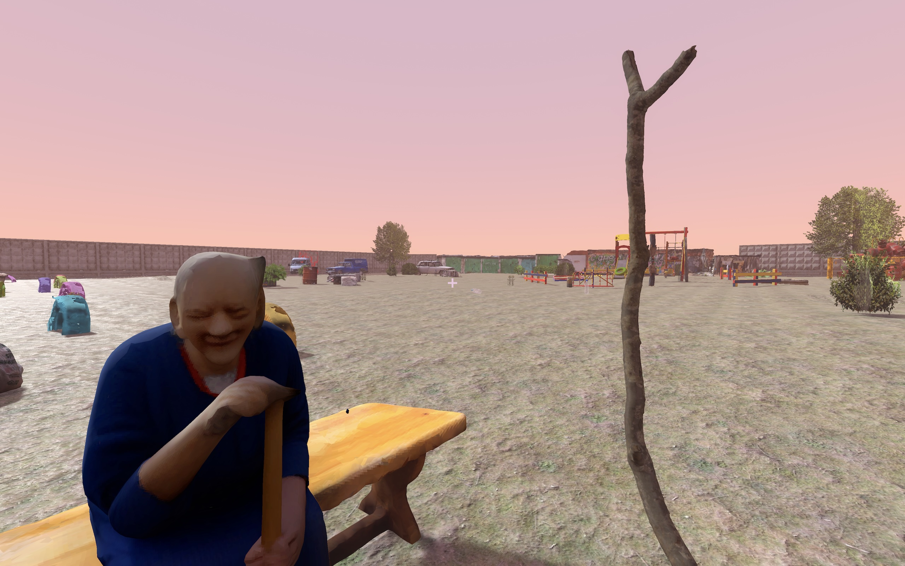
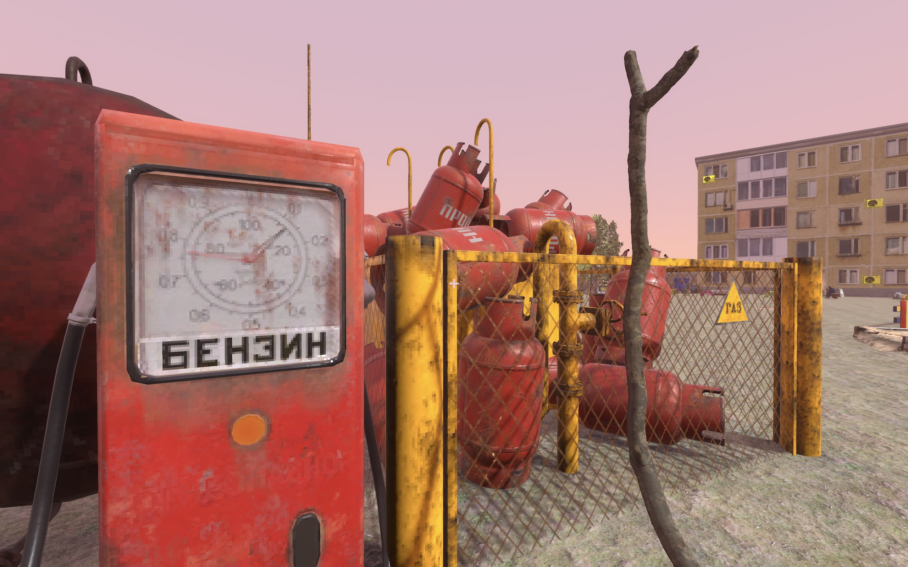
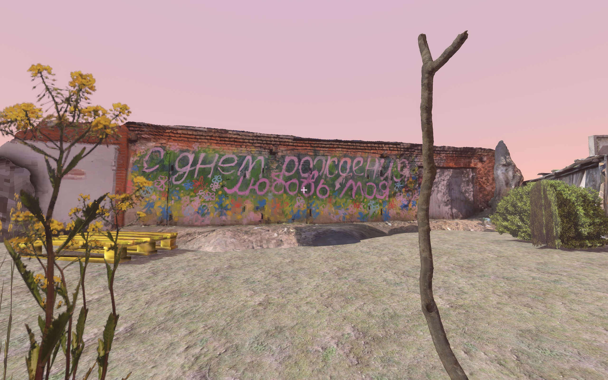

# ld57 — Detstvo
A game “Detstvo” by “хорошие родители — это родители, которые не выдуманы” team.

Hit everything you see with a stick. Just like when you were a kid.

Made by Senya Pugach & Sava Pugach in two days in April 2025.

### Play
[in browser](http://upisfr.ee/game/ld57) or download for [Windows](https://github.com/upisfree/ld57/releases/download/v1.0.0/DetstvoWindows.zip), [macOS](https://github.com/upisfree/ld57/releases/download/v1.0.0/DetstvoMacOS.zip).

[Ludum Dare entry](https://ldjam.com/events/ludum-dare/57/detstvo).

### Playthrough

### Screenshots

### How to adapt game for web
If you try to build game for web, you will find that everything is very bright and sometimes you don't click on objects. To fix this, do this:
1. Change renderer to Compatibility
2. Adapt Environment glow intensity and glow bloom
3. Adapt directional light intensity
4. Move RayCast3D ray slightly to the left

### How to build
There's `mdl.glb` in Release page that you need to download and put into `mdl/` folder to build a game.